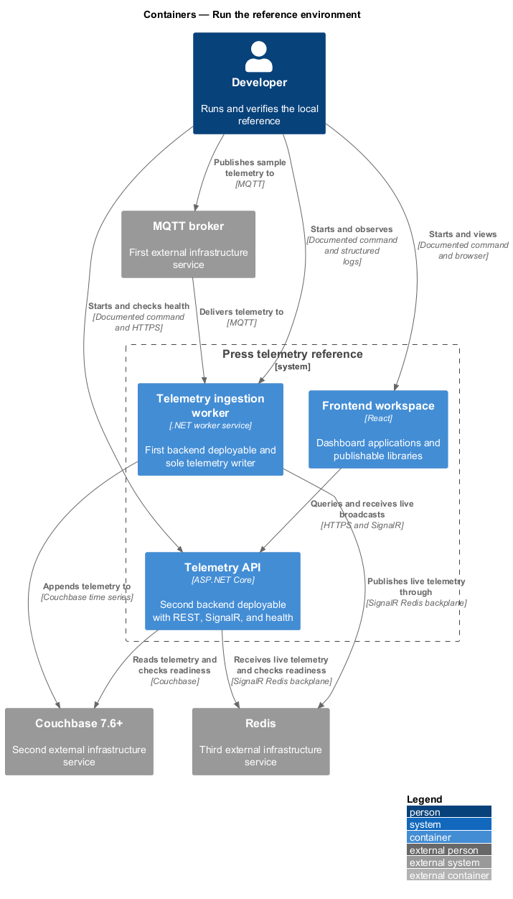

# Press Telemetry Reference

Press Telemetry Reference is an end-to-end sample for ingesting industrial telemetry and
displaying historical and live values in a responsive web dashboard. It uses MQTT, .NET,
Couchbase time series, Redis, SignalR, React, and TypeScript.

Use this repository to explore a deliberately small telemetry architecture: one ingestion
path, two backend processes, one frontend workspace, and three infrastructure dependencies.

> [!IMPORTANT]
> This project is a reference implementation for local development and architecture
> evaluation. End-user authentication, authorization, TLS termination, and production
> deployment are outside its scope. See [Security and production use](#security-and-production-use).

## What the sample demonstrates

- Validating MQTT telemetry at the system boundary.
- Appending telemetry to Couchbase time series documents through a single writer.
- Serving snapshot and time-range data from an ASP.NET Core REST API.
- Broadcasting live updates through Redis and SignalR without polling.
- Patching and batching a TanStack Query cache at approximately 1 Hz.
- Rendering a responsive, dark-mode React dashboard with on-demand view loading.
- Reporting Couchbase and Redis readiness through a health endpoint.

## Architecture

An external publisher sends telemetry to MQTT. The ingestion worker validates each point,
stores it in Couchbase, and publishes it to Redis. The API reads history from Couchbase and
relays Redis messages through SignalR. The React dashboard hydrates from REST, then applies
live updates to the same client-side cache.



| Component | Location | Responsibility |
| --- | --- | --- |
| Ingestion worker | [`backend/src/Telemetry.Ingestion.Worker`](backend/src/Telemetry.Ingestion.Worker) | Validate MQTT messages, write time series data, and publish live updates |
| Telemetry API | [`backend/src/Telemetry.Api`](backend/src/Telemetry.Api) | Serve REST queries, SignalR updates, and dependency health |
| Dashboard | [`frontend/apps/dashboard`](frontend/apps/dashboard) | Render snapshot, range, and live telemetry |
| Frontend libraries | [`frontend/libs`](frontend/libs) | Provide reusable dashboard components and telemetry views |
| Acceptance tests | [`backend/tests/Telemetry.IntegrationTests`](backend/tests/Telemetry.IntegrationTests) and [`frontend/e2e`](frontend/e2e) | Verify backend integration and browser behavior |
| Requirements and designs | [`docs`](docs) | Define requirements, decisions, UI mocks, and detailed designs |

## Getting started

### Prerequisites

- [Git](https://git-scm.com/downloads)
- [.NET 10 SDK](https://dotnet.microsoft.com/download/dotnet/10.0) (`backend/global.json`
  requests version `10.0.100`)
- [Node.js](https://nodejs.org/en/download) `20.19+`, `22.13+`, or `24+`
- [Docker](https://docs.docker.com/get-docker/) with Docker Compose

Run all commands from the repository root unless a step says otherwise.

### 1. Clone the repository and install frontend dependencies

```sh
git clone https://github.com/QuinntyneBrown/press-telemetry-reference.git
cd press-telemetry-reference
npm ci --prefix frontend
```

### 2. Start local infrastructure

```sh
docker compose up -d
docker compose ps --all
```

Compose starts Mosquitto, Couchbase 7.6 Enterprise, and Redis. A one-time initializer creates
the `telemetry` bucket and primary index. Continue when Mosquitto and Redis are healthy and
`couchbase-init` has exited with code `0`.

> [!NOTE]
> After cluster initialization, Compose can label Couchbase `unhealthy` because the container
> probe calls an endpoint that now requires credentials. A successful `couchbase-init` and the
> API readiness check in step 4 confirm that Couchbase is available to the application.

### 3. Start the application

Open three terminals at the repository root and run one command in each terminal.

**Terminal 1 — ingestion worker**

```sh
dotnet run --project backend/src/Telemetry.Ingestion.Worker
```

**Terminal 2 — API**

```sh
dotnet run --project backend/src/Telemetry.Api -- --urls http://localhost:5063
```

**Terminal 3 — dashboard**

```sh
npm run dev --prefix frontend
```

Open <http://localhost:5173>. The explicit API URL matches the dashboard's committed Vite
development proxy.

### 4. Verify the pipeline

Check API readiness:

```sh
curl http://localhost:5063/health
```

A healthy response reports both `couchbase` and `redis` as `Healthy`.

Publish a sample point. The publisher is simulated here because it is not part of the
reference implementation.

```sh
docker compose exec mosquitto sh -c 'mosquitto_pub -t telemetry/press-01/temperature -m "{\"deviceId\":\"press-01\",\"metric\":\"temperature\",\"value\":87.4,\"timestamp\":\"$(date -u +%Y-%m-%dT%H:%M:%SZ)\"}"'
```

The command timestamps the point with the current UTC time, and the `press-01` temperature
appears on the dashboard. You can also query the latest values directly:

```sh
curl http://localhost:5063/api/telemetry/latest
```

Stop the infrastructure when you are finished:

```sh
docker compose down
```

## API

| Endpoint | Description |
| --- | --- |
| `GET /api/telemetry/latest` | Return the newest stored point for every known device and metric |
| `GET /api/telemetry/{deviceId}/{metric}?from={iso}&to={iso}` | Return points in the half-open interval `[from, to)`, ordered by timestamp; the maximum range is 24 hours |
| `/hubs/telemetry` | Broadcast each ingested point as a SignalR `telemetry` message |
| `GET /health` | Report Couchbase and Redis readiness |

Invalid route or query parameters return
[RFC 7807 Problem Details](https://www.rfc-editor.org/rfc/rfc7807). Browser access is limited
to origins in the configured CORS allowlist.

## Configuration

Committed settings target local services and use only the well-known Couchbase development
credentials `Administrator` / `password`. Do not use these defaults outside local development.

Backend settings are in
[`backend/src/Telemetry.Ingestion.Worker/appsettings.json`](backend/src/Telemetry.Ingestion.Worker/appsettings.json)
and [`backend/src/Telemetry.Api/appsettings.json`](backend/src/Telemetry.Api/appsettings.json).
Override a setting with the corresponding environment variable by replacing `:` with `__`.
For example, `Worker:MqttBroker` becomes `Worker__MqttBroker` and `Api:CorsOrigins:0` becomes
`Api__CorsOrigins__0`.

| Process | Settings |
| --- | --- |
| Worker | `MqttBroker`, `MqttTopicFilter`, `CouchbaseConnectionString`, `CouchbaseUsername`, `CouchbasePassword`, `CouchbaseBucket`, `RedisConnectionString` under `Worker` |
| API | `CouchbaseConnectionString`, `CouchbaseUsername`, `CouchbasePassword`, `CouchbaseBucket`, `RedisConnectionString`, `CorsOrigins` under `Api` |
| Dashboard | `VITE_API_BASE_URL`; when unset, REST and SignalR use the current origin through the Vite proxy |

Both backend processes emit structured JSON logs. Set `Logging__LogLevel__Default` to change
the default log level. A missing required backend setting stops startup and names the invalid
setting.

## Build and test

The backend acceptance suite provisions isolated Couchbase, Redis, and Mosquitto containers
with Testcontainers. Docker must be running.

```sh
dotnet test backend/Telemetry.slnx
```

Run frontend validation from `frontend`:

```sh
cd frontend
npm ci
npm run typecheck
npm run lint
npm run build
npx playwright install chromium
npm run e2e
```

The Playwright suite mocks REST and SignalR in the browser, so it does not require the backend
or infrastructure services. See the [frontend guide](frontend/README.md) for workspace details
and interactive test commands.

To scan the repository history for accidentally committed credentials, install
[Gitleaks](https://github.com/gitleaks/gitleaks) and run:

```sh
gitleaks git .
```

## Design boundaries

The implementation makes the following explicit trade-offs to stay small and understandable:

- **MQTT uses QoS 0.** Delivery is at most once. Messages sent while the worker is disconnected
  are lost.
- **Redis does not replay live updates.** Points received during a Redis outage remain in
  Couchbase, but connected clients do not receive them retroactively. Clients repair the gap
  by refetching REST data after SignalR reconnects.
- **Failed persistence is bounded.** The worker retries a Couchbase write up to three times with
  exponential backoff, then logs and drops that point. Later points continue through the
  pipeline.
- **The API broadcasts every series.** There are no server-side subscription groups because the
  dashboard consumes all telemetry at reference scale.

For background on the messaging choice, see
[Redis Pub/Sub instead of Kafka](docs/redis-pub-sub-instead-of-kafka.md) and
[where Kafka could fit](docs/kafka-in-the-solution.md).

## Security and production use

The REST API and SignalR hub are unauthenticated by design. A production implementation must
add authentication, tenant-appropriate authorization, TLS, managed secrets, and operational
controls for its environment. The sample does include boundary validation, a configurable
CORS allowlist, startup configuration validation, and structured dependency health checks.

## Documentation

| Document | Description |
| --- | --- |
| [L1 requirements](docs/specs/L1.md) | System goals and scope |
| [L2 requirements](docs/specs/L2.md) | Detailed behavior and acceptance criteria |
| [Telemetry ingestion design](docs/detailed-designs/telemetry/ingest-telemetry/README.md) | MQTT validation, persistence, retry, and live fan-out |
| [Query and streaming design](docs/detailed-designs/telemetry/query-and-stream-telemetry/README.md) | REST queries, health, and SignalR delivery |
| [Dashboard designs](docs/detailed-designs/dashboard) | Loading, live updates, responsive layout, and view composition |
| [Reference environment design](docs/detailed-designs/operations/run-reference-environment/README.md) | Local infrastructure, configuration, health, and logging |

## Contributing

Keep changes within the requirements and simplicity constraints documented above. Before
opening a pull request, run the relevant backend and frontend checks in [Build and test](#build-and-test),
and update the requirements or detailed designs when behavior or architecture changes.
