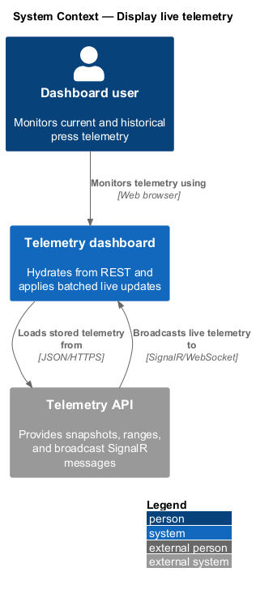
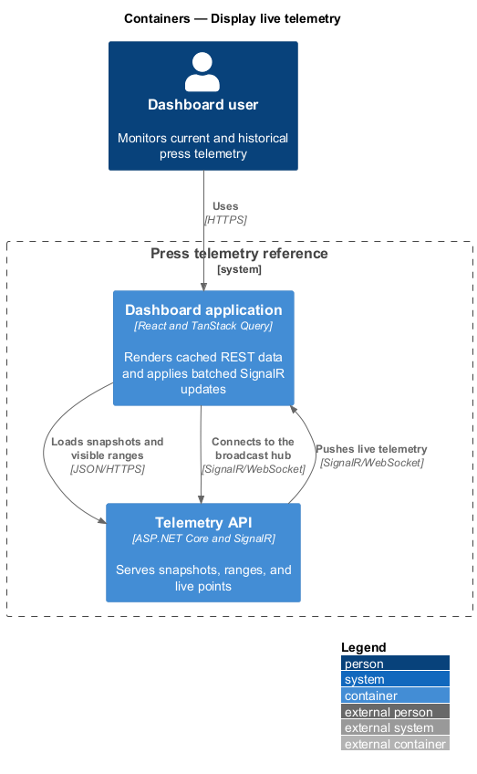
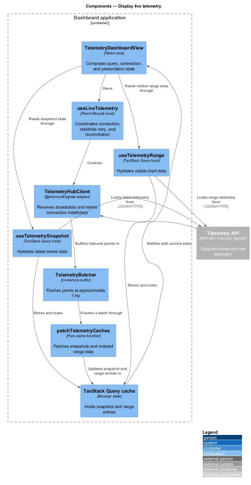
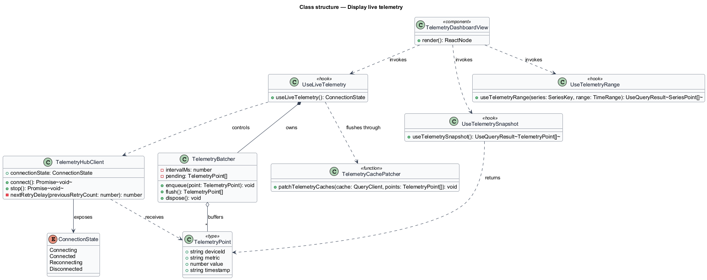
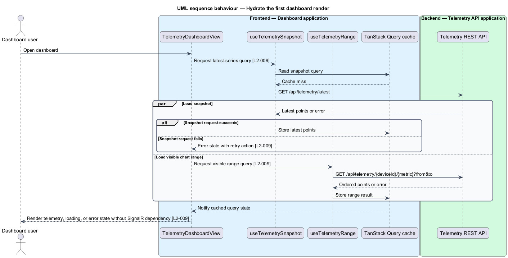
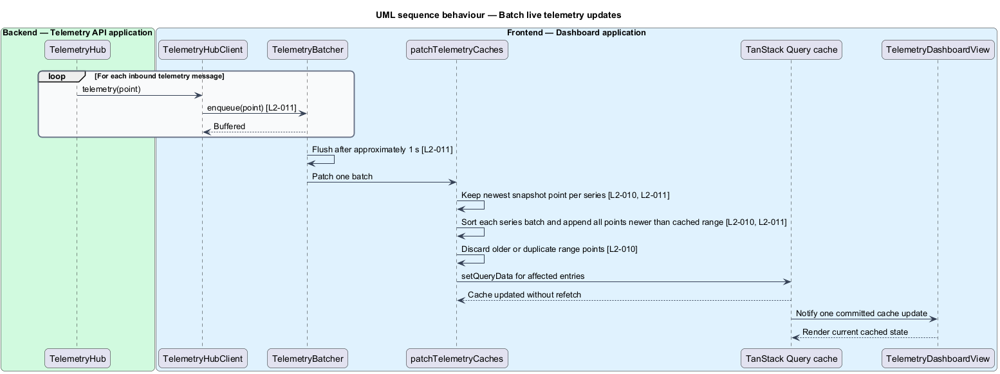
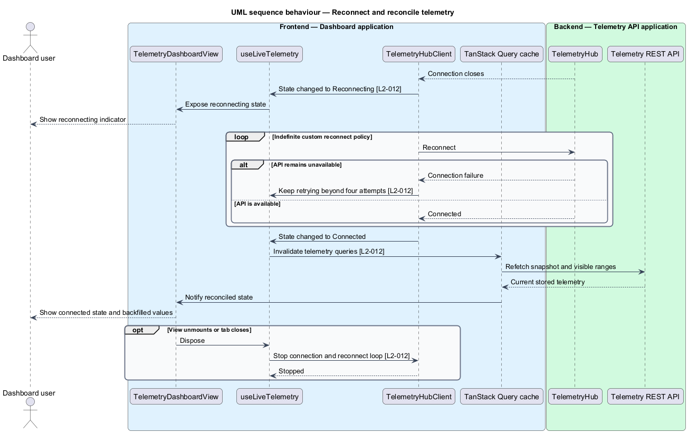

# Display live telemetry

## Overview

The dashboard data layer combines an initial REST snapshot with subsequent SignalR messages in one TanStack Query cache. The first render does not depend on live traffic. Later live messages patch cached snapshot and range data without polling or per-message refetches.

*query cache* — TanStack Query state holding REST results used by dashboard views

*flush interval* — approximately 1 s window during which live points accumulate before one cache update

*reconciliation* — REST refetch after reconnection that fills points missed while SignalR was unavailable

The feature limits render pressure by batching inbound messages at approximately 1 Hz. Each snapshot series keeps the newest timestamp. Range updates append all new in-order points and discard points older than the newest cached range timestamp. Connection state remains visible, and an indefinite reconnect policy continues until recovery or teardown.

## Description

The feature introduces the following frontend parts.

- **`useTelemetrySnapshot`** — TanStack Query hook that loads `/api/telemetry/latest` and exposes loading, error, retry, and data state.
- **`useTelemetryRange`** — TanStack Query hook that loads the visible chart range on demand.
- **`TelemetryHubClient`** — wrapper around `@microsoft/signalr` with a custom reconnect policy that retries indefinitely.
- **`TelemetryBatcher`** — in-memory buffer that flushes inbound points to the cache at approximately 1 Hz.
- **`patchTelemetryCaches`** — pure cache-update function that advances snapshots only for newer timestamps, appends each new in-order range point, and discards older or duplicate range points.
- **`useLiveTelemetry`** — lifecycle hook that connects the broadcast hub, feeds `TelemetryBatcher`, invalidates telemetry queries after reconnection, and stops the connection during teardown.
- **`TelemetryDashboardView`** — application view that composes query state, live connection state, and presentation components from `dashboard-core`.

The hooks own network and cache behavior. Presentation components receive data and status through props. A single batch flush updates all affected series, which keeps cache commit frequency independent of inbound message rate.

## Requirements

The feature realizes the following level-2 (L2) requirements. Each L2 requirement refines the cited level-1 (L1) requirement.

| L2 ID | Refines (L1) | Requirement |
|-------|--------------|-------------|
| `L2-009` | `L1-005` | The dashboard shall load its initial data by calling the snapshot endpoint (and the range endpoint for any visible chart) through TanStack Query, and shall render from that cache without waiting for any SignalR traffic. |
| `L2-010` | `L1-005` | Incoming SignalR telemetry messages shall update the existing TanStack Query cache in place — patching the snapshot entry and appending to any cached range data — rather than triggering refetches. |
| `L2-011` | `L1-005` | The frontend shall buffer incoming SignalR messages and commit them to the query cache in batches at approximately 1 Hz, regardless of inbound message rate. Within each flush, the latest value per series wins for the snapshot entry, while all buffered points are appended to cached range data (subject to the ordering rules of L2-010). |
| `L2-012` | `L1-005` | The frontend shall connect with `@microsoft/signalr` using a reconnect policy that retries indefinitely — custom retry delays passed to `withAutomaticReconnect`, or an `onclose` handler that restarts the connection — because the library's default policy stops after four attempts. On reconnection the client shall invalidate telemetry queries so missed points are backfilled from REST, and connection state shall be visible in the UI. |

## Diagrams

### System context

The dashboard user views telemetry through the press telemetry reference. REST supplies current stored state, and SignalR supplies live changes.

### Containers

The React dashboard obtains initial data from the API and keeps one local query cache current through the broadcast SignalR connection.

### Components

Query hooks hydrate the cache, while `TelemetryHubClient`, `TelemetryBatcher`, and `patchTelemetryCaches` form the live update path.

### Class structure

`useLiveTelemetry` coordinates the hub client and batcher. Cache patching remains a pure dependency shared by each flush.

### Behaviour — hydrate the first render

The view renders loading or error state while REST queries run, then presents cached data without waiting for SignalR.

### Behaviour — batch live updates

Inbound points accumulate for approximately 1 s. One flush applies latest-wins to snapshots and appends all eligible range points without issuing a REST request.

### Behaviour — reconnect and reconcile

The indefinite reconnect policy invalidates telemetry queries after recovery. The subsequent REST responses backfill data missed during the outage.

