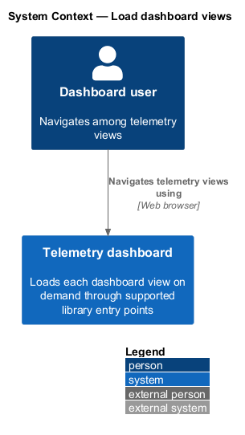
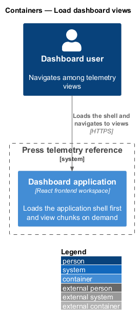
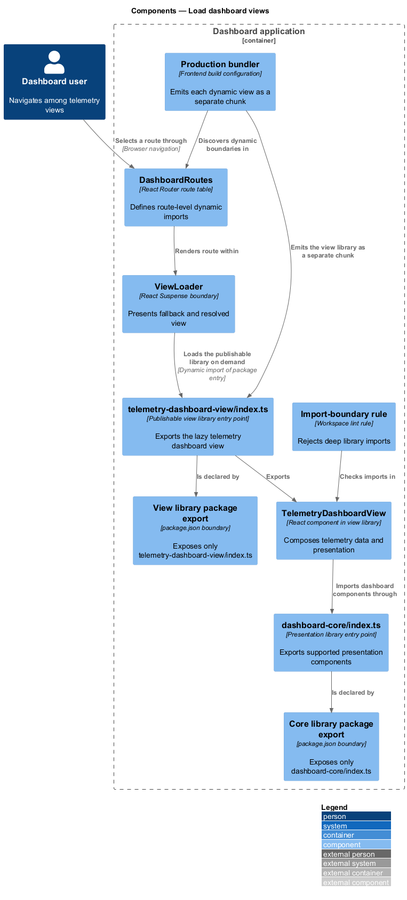
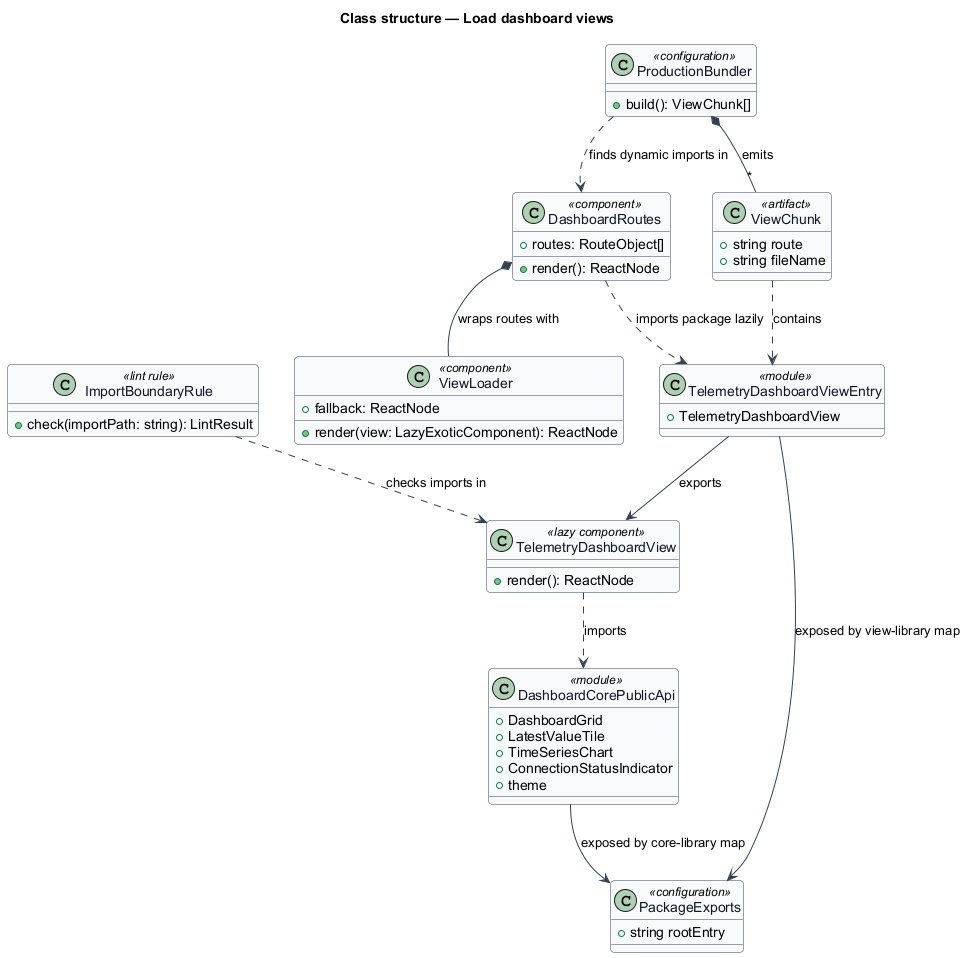
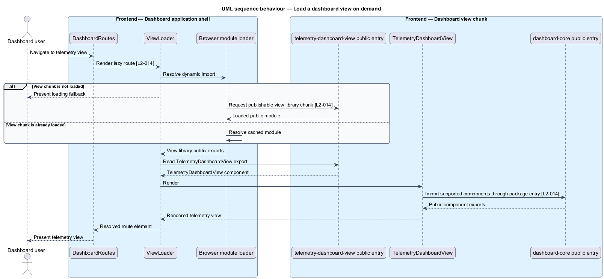

# Load dashboard views

## Overview

The frontend workspace separates reusable libraries from its consuming dashboard application. Each library exposes one supported package entry point. Every dashboard view lives in a publishable view library whose public entry point loads as a separate production chunk.

*public entry point* — package export that defines the supported imports available to an application

*view library* — publishable workspace package that exposes one dashboard view through its public entry point

The feature keeps the initial application bundle independent of view implementations. Route-level loading boundaries present a fallback during the first download and render the loaded view afterward. Workspace checks reject imports that bypass a library package export.

## Description

The feature introduces the following workspace parts.

- **`DashboardRoutes`** — application route table whose view elements use `React.lazy` to import a view library's package entry point.
- **`ViewLoader`** — `Suspense` boundary that presents the route loading state and renders the resolved view.
- **`telemetry-dashboard-view/index.ts`** — public entry point of the publishable view library that exports `TelemetryDashboardView`.
- **`TelemetryDashboardView`** — route component inside the view library that composes application data hooks with `dashboard-core`.
- **`dashboard-core/index.ts`** — the library's single public package entry point.
- **view-library `package.json` exports** — package boundary declaring only `telemetry-dashboard-view/index.ts` as the supported entry point.
- **workspace lint rule** — import-boundary check that rejects deep imports into library internals.
- **production bundler configuration** — workspace build configuration that emits each dynamic view import as a separate chunk.

Application code dynamically imports `telemetry-dashboard-view` only through its package name. The view library imports `dashboard-core` through that library's package name. These public boundaries let the production bundler keep all view-library code out of the initial bundle.

## Requirements

The feature realizes the following level-2 (L2) requirement, which refines the cited level-1 (L1) requirement.

| L2 ID | Refines (L1) | Requirement |
|-------|--------------|-------------|
| `L2-014` | `L1-006` | Each workspace library shall expose a single public entry point (its package export); deep imports into library internals are disallowed. Dashboard views live in publishable view libraries, and the application loads each view library dynamically — a dynamic `import()` of the library's public entry point — so the libraries themselves are both public (publishable, explicit API) and dynamic (code-split, loaded on demand). |

## Diagrams

### System context

The dashboard user selects a view through the press telemetry frontend, which loads the corresponding view code on demand.

### Containers

The browser loads the application shell first and requests a publishable view library's separate chunk when route navigation reaches that view.

### Components

`DashboardRoutes` dynamically imports the view library's public entry point inside `ViewLoader`. The exported view imports `dashboard-core` through its public entry point.

### Class structure

The route table depends on publishable view-library entry points, while each view depends on the exported `dashboard-core` surface rather than library internals.

### Behaviour — navigate to a view

The first navigation downloads the view library chunk and renders a fallback until resolution. Later navigation uses the browser's loaded module.

