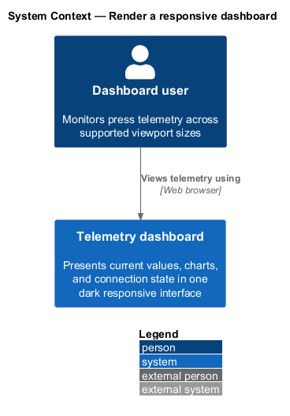
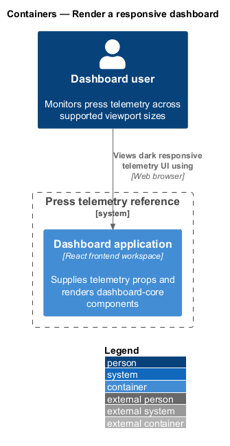
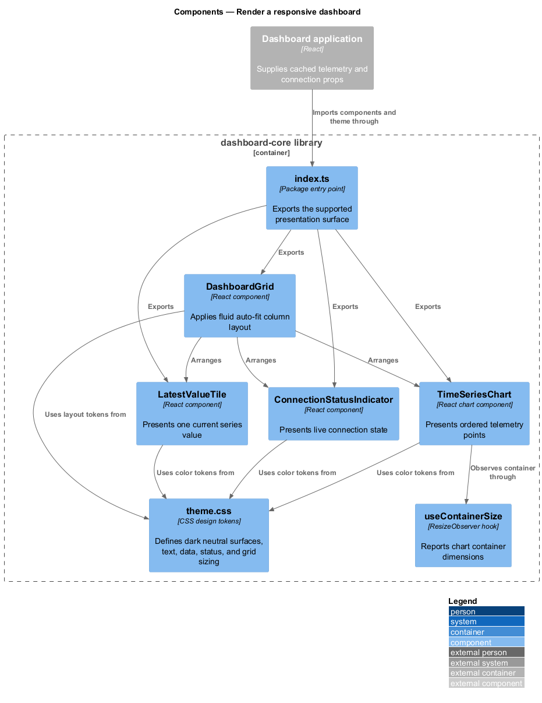
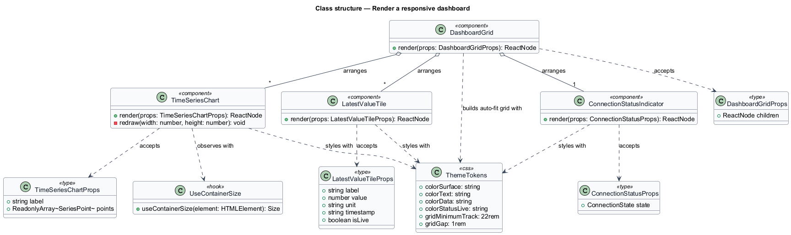
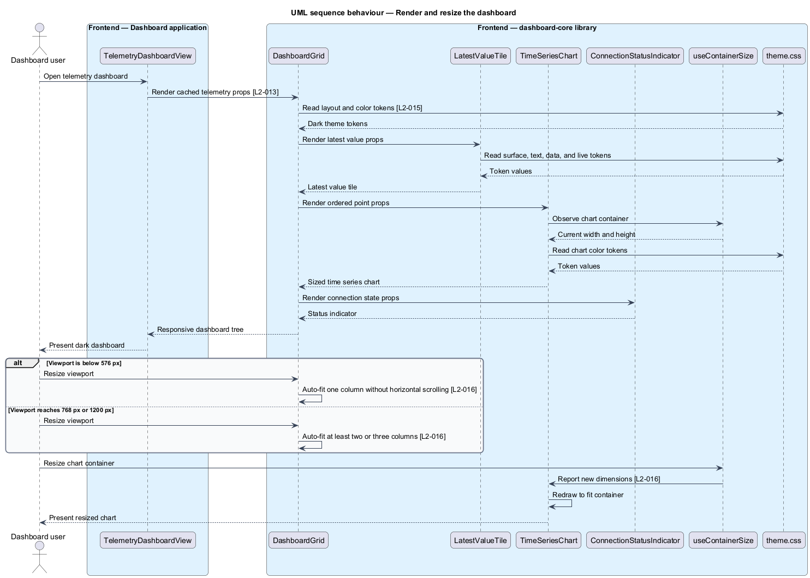

# Render a responsive dashboard

## Overview

The dashboard presentation layer renders current values, time series, connection state, and grid layout through a reusable `dashboard-core` library. The library contains no networking or query-cache logic. Applications supply all telemetry and state through component props.

*design token* — CSS custom property that gives a named visual value to surfaces, text, data, accents, spacing, or layout

*responsive breakpoint* — viewport width at which the dashboard grid changes its column arrangement

The reference ships one dark theme with high-contrast data and restrained status accents. Surface tokens stay at or below 0.1 relative luminance and 10% HSL saturation. A fluid auto-fit grid produces one column below 576 px, at least two columns at 768 px, and at least three columns at 1200 px. Charts observe their containers and redraw to the available size.

## Description

The feature introduces the following `dashboard-core` parts.

- **`LatestValueTile`** — presentation component for a series name, value, unit, timestamp, and live emphasis state.
- **`TimeSeriesChart`** — responsive chart component that accepts ordered points and redraws when its container changes size.
- **`ConnectionStatusIndicator`** — presentation component for connected, reconnecting, and disconnected states.
- **`DashboardGrid`** — layout component that applies a fluid auto-fit grid with a 22 rem minimum tile width capped by the container width.
- **`useContainerSize`** — local presentation hook backed by `ResizeObserver`; it performs no data fetching.
- **`theme.css`** — single source for color and layout design tokens.
- **`index.ts`** — public package entry point exporting the four components, their prop types, and the theme.

The library accepts serializable data and status props. Application-specific hooks remain outside the package. Component styles reference tokens from `theme.css`, and no component declares a color literal.

## Requirements

The feature realizes the following level-2 (L2) requirements. Each L2 requirement refines the cited level-1 (L1) requirement.

| L2 ID | Refines (L1) | Requirement |
|-------|--------------|-------------|
| `L2-013` | `L1-006` | The workspace shall contain a `dashboard-core` library of reusable, presentation-focused components — at minimum a time series chart, a latest-value tile, a connection status indicator, and a dashboard grid layout — plus the theme. Components receive data via props and perform no data fetching themselves. One consuming application satisfies L1-006. |
| `L2-015` | `L1-007` | The UI shall ship a single dark theme in the spirit of Open MCT: dark neutral surfaces, high-contrast text and data, restrained accent colors for live/status emphasis. All colors are defined as design tokens (CSS custom properties) in `dashboard-core`; components never hard-code colors. |
| `L2-016` | `L1-007` | The dashboard shall adapt fluidly across extra-small (<576px), small (>=576px), medium (>=768px), large (>=992px), and extra-large (>=1200px) viewports: a single column below 576px, at least two columns at >=768px, and at least three at >=1200px, with charts resizing to their containers. A fluid auto-fit CSS grid meeting these outcomes is an acceptable implementation; no named breakpoint system is required. |

## Diagrams

### System context

The dashboard user reads press telemetry through a dark, responsive presentation supplied by the frontend workspace.

### Containers

The dashboard application supplies telemetry props to `dashboard-core`, which renders browser UI without accessing the API.

### Components

`DashboardGrid` uses a fluid auto-fit rule to arrange tiles, charts, and connection status. `TimeSeriesChart` uses container size to redraw within the grid.

### Class structure

The public components depend on prop types and theme tokens. Only `TimeSeriesChart` depends on `useContainerSize`.

### Behaviour — render and resize

The application passes cached telemetry into presentation components. Continuous viewport and chart-container changes update layout without fetching data.

