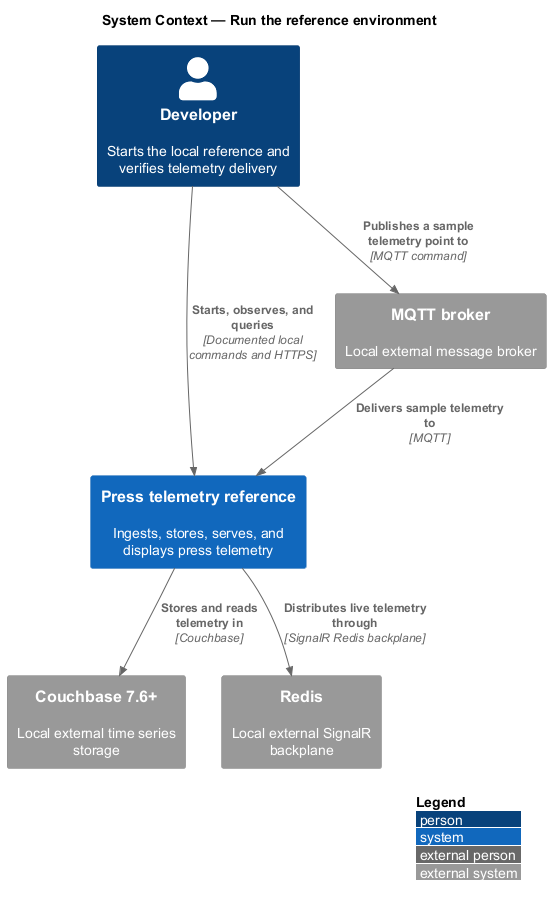
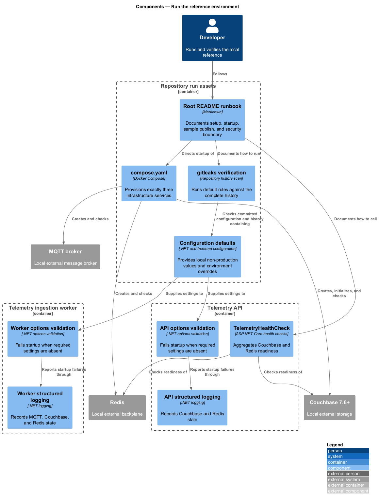
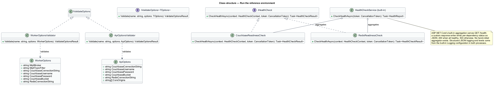
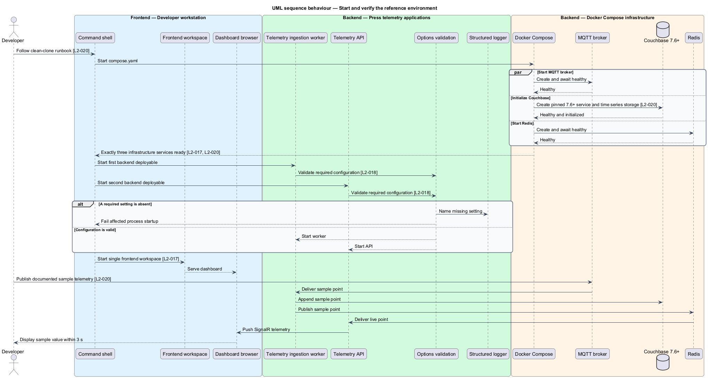
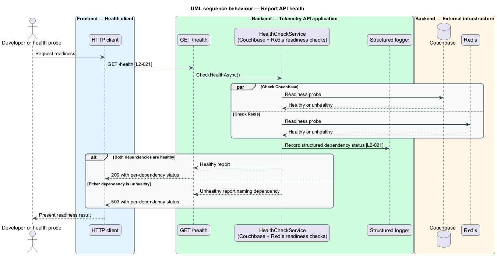

# Run the reference environment

## Overview

The runnable reference environment gives a developer one documented path from a clean clone to a visible telemetry value. Docker Compose provisions the three external infrastructure services: an MQTT broker, Couchbase, and Redis. Separate commands start the ingestion worker, API, and frontend workspace.

*readiness* — ability of the API to serve requests using its required Couchbase and Redis dependencies

*structured log* — log event represented by named fields rather than only formatted text

The solution retains exactly two backend deployables and one frontend workspace. Configuration supplies every connection value and credential, with environment variables taking precedence over local committed defaults. The API health endpoint reports dependency readiness, while both backend processes emit configurable structured logs.

## Description

The feature introduces the following repository and runtime parts.

- **`compose.yaml`** — local infrastructure definition containing one MQTT broker, one Couchbase 7.6-or-later service, and one Redis service.
- **Couchbase initializer** — Compose initialization step that creates the required bucket, scope, collection, and time series document storage.
- **`Telemetry.Ingestion.Worker`** — first backend deployable and sole telemetry writer.
- **`Telemetry.Api`** — second backend deployable exposing REST, SignalR, and `/health`.
- **frontend workspace** — single React workspace containing dashboard applications and publishable libraries.
- **options validation** — startup validation in each backend process that names any absent required setting and stops startup.
- **`CouchbaseReadinessCheck` / `RedisReadinessCheck`** — per-dependency readiness checks aggregated by ASP.NET Core's built-in health check service into `GET /health` (200 when all healthy, 503 naming the unhealthy dependency).
- **structured logging configuration** — shared log-level and connection-state event conventions for MQTT, Couchbase, and Redis.
- **gitleaks verification command** — repository-history scan using the default gitleaks rules.
- **root `README.md` runbook** — clean-clone setup, infrastructure initialization, process start commands, manual sample publish command, QoS 0 and Redis-outage delivery trade-offs, and production security boundary.

Committed values refer only to local development hosts and well-known development credentials. Secret-bearing override files remain excluded from source control. The gitleaks command scans the complete repository history with default rules. The runbook states that authentication and authorization remain outside the reference and identifies them as production integration work.

## Requirements

The feature realizes the following level-2 (L2) requirements. Each L2 requirement refines the cited level-1 (L1) requirement.

| L2 ID | Refines (L1) | Requirement |
|-------|--------------|-------------|
| `L2-017` | `L1-008` | The solution shall consist of exactly two backend deployables (ingestion worker, API), one frontend workspace, and exactly three external infrastructure services (MQTT broker, Couchbase, Redis). Telemetry has one write path and one live path; no component beyond those named here may be introduced. |
| `L2-018` | `L1-009` | All connection strings and credentials shall come from configuration (environment variables or local override files excluded from source control). The repository must contain no real secrets; committed defaults must reference only local development infrastructure. |
| `L2-020` | `L1-010` | The repository shall include a Docker Compose file provisioning the MQTT broker, Couchbase Server (pinned to a version with time series support, 7.6 or later), and Redis for local development, plus README instructions from clean clone to running dashboard. The external telemetry publisher remains out of scope; the README shall show how to publish a sample message manually to verify the pipeline. |
| `L2-021` | `L1-010` | The API shall expose `GET /health` reporting readiness of its Couchbase and Redis dependencies. Both backend processes shall emit structured logs, including connection state changes for MQTT, Couchbase, and Redis, with level configurable via configuration. |

## Diagrams

### System context

A developer starts the reference solution on a workstation, publishes a sample MQTT message, and observes the dashboard and health response.

### Containers

The runtime contains two backend deployables, one frontend workspace, and exactly three external infrastructure services.

### Components

Compose and the runbook establish infrastructure and configuration. Backend startup validation, health checks, and structured logging expose runtime state.

### Class structure

Typed options feed both backend processes. The API health check aggregates Couchbase and Redis readiness, while logging configuration controls both processes.

### Behaviour — start and verify the environment

The documented path starts infrastructure, validates process configuration, and sends one sample point through the complete pipeline.

### Behaviour — report health

The API evaluates Couchbase and Redis readiness for each `/health` request and returns `200` or `503` with per-dependency status.

