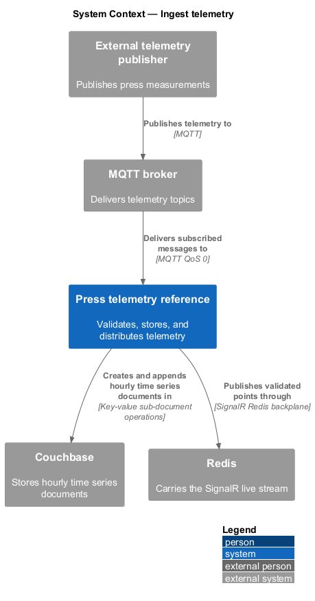
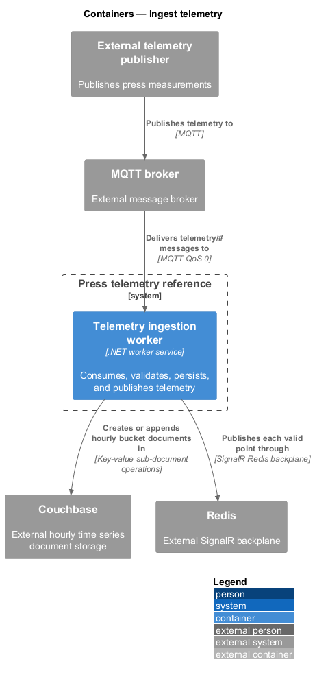
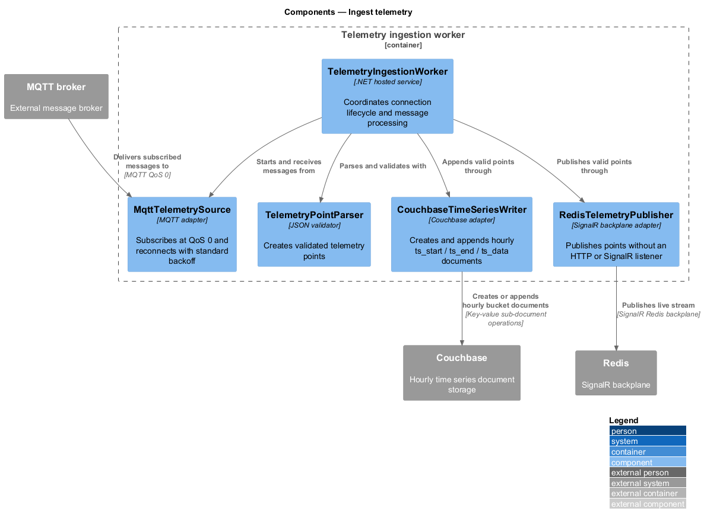
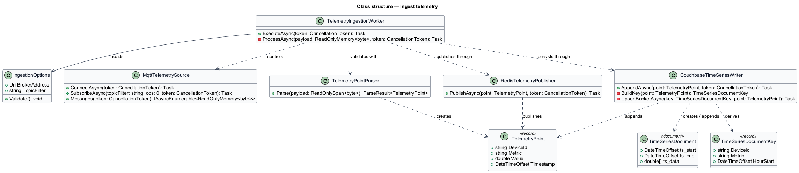
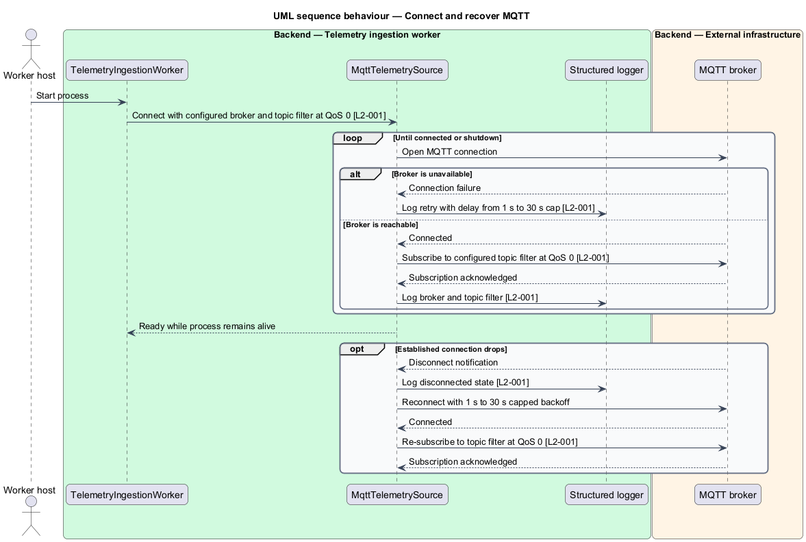
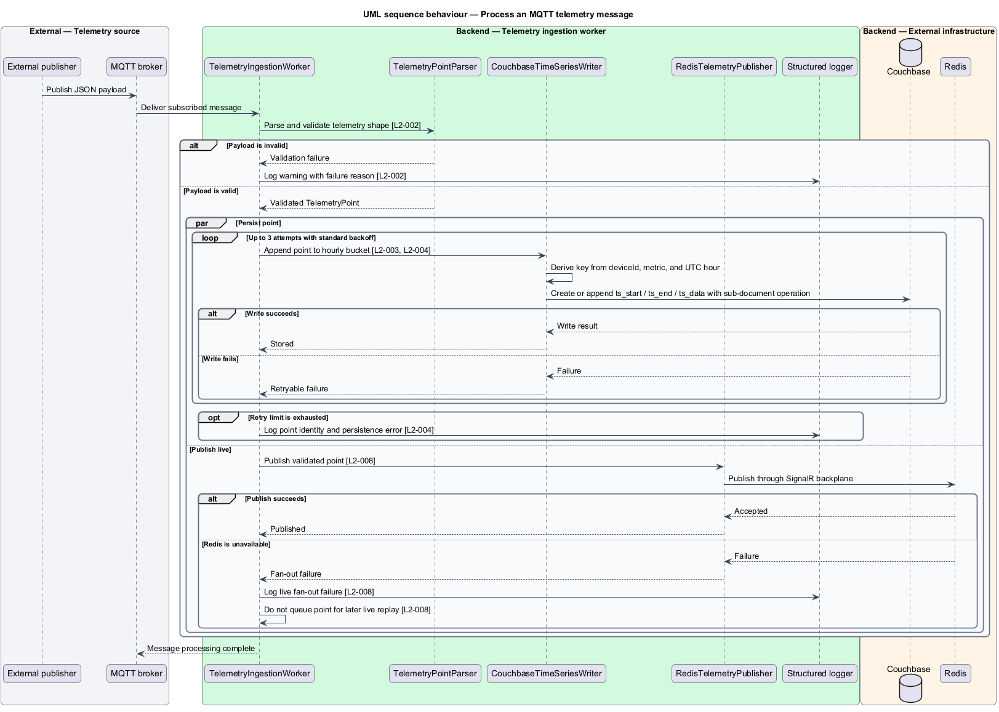

# Ingest telemetry

## Overview

The press telemetry reference receives measurements from an external publisher and makes each accepted measurement available for storage and live delivery. The publisher and MQTT broker remain outside the solution boundary. The ingestion worker owns the only telemetry write path.

*telemetry point* — measured value identified by a device, metric, and UTC timestamp

*topic filter* — MQTT subscription expression that selects the messages delivered to the worker

*hourly time bucket* — UTC hour used with `deviceId` and `metric` to identify one Couchbase time series document

The feature connects to MQTT at QoS 0, validates each JSON payload, appends valid points to Couchbase time series documents, and publishes the same points through Redis. QoS 0 provides at-most-once delivery. A missed dashboard sample is an accepted trade-off, and the worker contains no duplicate-delivery handling.

Connection and dependency failures remain isolated from the worker process so later messages continue through the pipeline. Points missed during a Redis outage remain stored but are not replayed to already-connected clients after Redis recovers.

## Description

The feature introduces the following parts in the ingestion worker.

- **`TelemetryIngestionWorker`** — .NET hosted service that owns MQTT connection lifecycle and coordinates message processing.
- **`MqttTelemetrySource`** — MQTT adapter that subscribes at QoS 0 and reconnects with exponential delays from 1 s to a 30 s cap.
- **`TelemetryPointParser`** — JSON parser and validator for `deviceId`, `metric`, `value`, and `timestamp`.
- **`TelemetryPoint`** — immutable value carrying a validated device identifier, metric name, finite numeric value, and UTC timestamp.
- **`CouchbaseTimeSeriesWriter`** — sole persistence component that creates or appends hourly `ts_start` / `ts_end` / `ts_data` documents with key-value sub-document operations.
- **`TimeSeriesDocumentKey`** — value derived from `deviceId`, `metric`, and the point's UTC hourly time bucket.
- **`RedisTelemetryPublisher`** — live-path adapter that publishes accepted points through the SignalR Redis backplane without an HTTP or SignalR listener.
- **`IngestionOptions`** — validated configuration for broker address, topic filter, Couchbase settings, and Redis settings.

`TelemetryIngestionWorker` passes a point to persistence and live fan-out only after `TelemetryPointParser` accepts the payload. Couchbase persistence makes at most 3 attempts using the standard backoff policy. Redis publication remains independent of persistence so failure in either destination does not stall later messages.

## Requirements

The feature realizes the following level-2 (L2) requirements. Each L2 requirement refines the cited level-1 (L1) requirement.

| L2 ID | Refines (L1) | Requirement |
|-------|--------------|-------------|
| `L2-001` | `L1-001` | The ingestion worker shall connect to the configured MQTT broker on startup and subscribe at QoS 0 to a configurable topic filter (default `telemetry/#`). At-most-once delivery is an accepted trade-off for this reference (a missed dashboard sample is tolerable, and QoS 0 removes any need for duplicate-delivery handling); the README must state this. The connection shall recover automatically using the standard backoff policy; broker unavailability must never terminate the worker process. |
| `L2-002` | `L1-001` | The worker shall parse each MQTT message body as a JSON telemetry point and validate it against the shape above. Invalid messages are dropped with a warning log; they never crash the worker and are never written to storage. |
| `L2-003` | `L1-002` | The worker shall append each valid telemetry point to Couchbase time series documents keyed by `deviceId`, `metric`, and an hourly time bucket, following Couchbase's time series document format (`ts_start`, `ts_end`, `ts_data`) so points are retrievable with the `_timeseries()` SQL++ function. Couchbase provides the document format convention and the query function but no dedicated time series write API: the worker itself creates and appends the bucketed documents via key-value sub-document operations. The worker is the sole telemetry writer in the solution. |
| `L2-004` | `L1-002` | When a Couchbase write fails, the worker shall retry up to 3 attempts per the standard backoff policy and then drop the point with an error log. Persistence failures must not stop ingestion or live fan-out of subsequent points. |
| `L2-008` | `L1-004` | The worker shall publish each valid telemetry point through the Redis backplane so every API instance delivers it to its own connected clients. The worker hosts no HTTP server and accepts no client connections, and the API's live push path never reads from Couchbase. Points ingested during a Redis outage are persisted but not retroactively delivered to already-connected clients; this gap is an accepted simplicity trade-off that the README must document. |

## Diagrams

### System context

The external publisher sends measurements through MQTT. The press telemetry reference validates and routes them to Couchbase and Redis.

### Containers

The ingestion worker is the only solution container in this slice. It consumes MQTT and writes independently to Couchbase and Redis.

### Components

The worker separates connection lifecycle, payload validation, time series persistence, and live publication into direct pipeline components.

### Class structure

`TelemetryIngestionWorker` depends on three boundary adapters and passes only validated `TelemetryPoint` values to the two output paths.

### Behaviour — connect and recover

The worker starts even when the broker is unavailable. `MqttTelemetrySource` retries from 1 s to a 30 s cap and restores the QoS 0 topic subscription after each connection.

### Behaviour — process a message

The message path validates before any side effect. Couchbase writes target hourly bucket documents, while Couchbase and Redis failures remain independent alternates.

