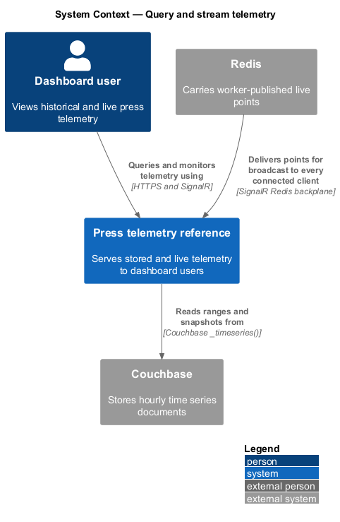
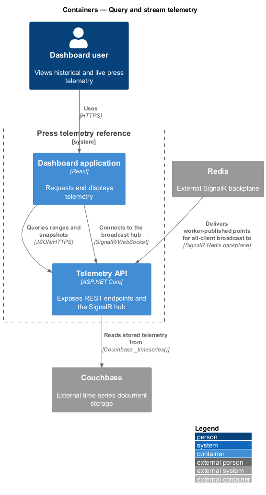
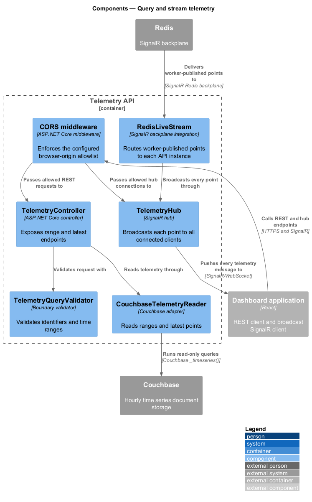
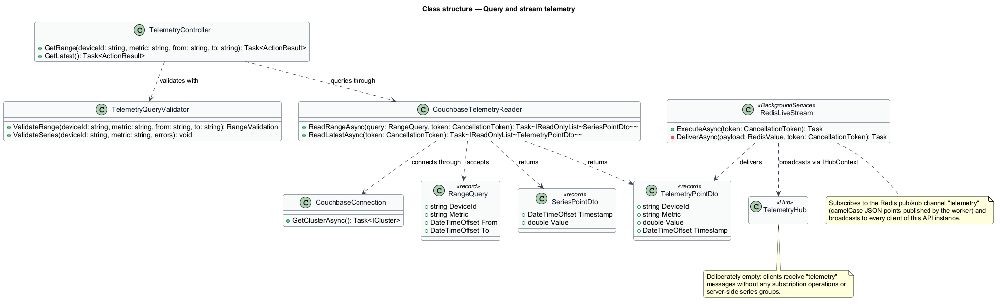
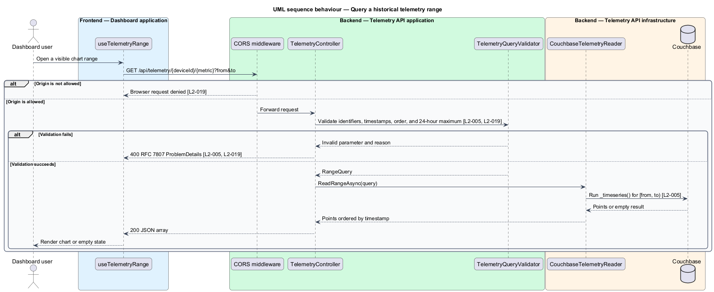
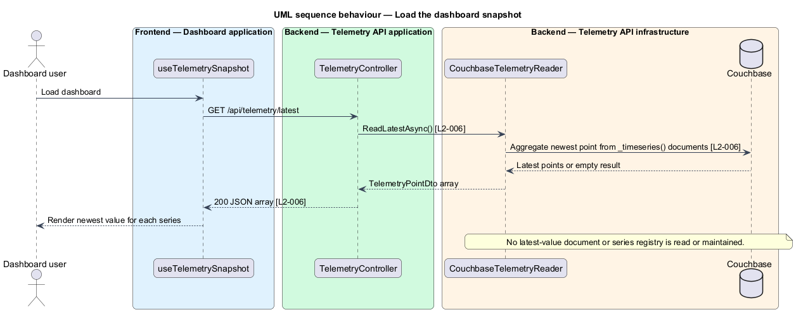
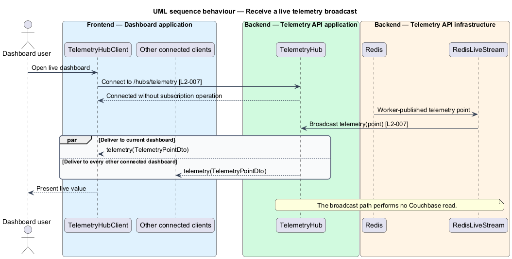

# Query and stream telemetry

## Overview

The telemetry API provides the dashboard with historical measurements, a first-render snapshot, and a broadcast live stream. Historical data comes from Couchbase. Live data arrives through Redis and reaches every connected browser through SignalR without a Couchbase read.

*series* — ordered telemetry points sharing one `deviceId` and `metric`

*snapshot* — newest stored telemetry point for every known series

*live broadcast* — SignalR message sent to every connected dashboard client without server-side series filtering

The feature exposes two REST resources and the `/hubs/telemetry` hub. Boundary validation rejects malformed identifiers and time ranges before any storage query. A configured CORS allowlist controls browser origins; end-user authentication and authorization remain outside the reference solution.

## Description

The feature introduces the following API parts.

- **`TelemetryController`** — ASP.NET Core controller exposing the range and latest snapshot endpoints.
- **`TelemetryQueryValidator`** — boundary validator for device identifiers, metric names, ISO-8601 timestamps, range order, and the fixed 24-hour maximum window.
- **`CouchbaseTelemetryReader`** — read-only adapter that runs `_timeseries()` range queries and an aggregate latest-series query over the time series documents.
- **`TelemetryHub`** — SignalR hub endpoint that broadcasts each new telemetry point to every connected client.
- **`RedisLiveStream`** — hosted background service in each API instance that subscribes to the Redis pub/sub channel `telemetry` (camelCase JSON points published by the worker) and broadcasts each point to that instance's connected clients through the hub.
- **`CouchbaseConnection`** — lazy shared Couchbase cluster connection used by the reader and the health check; a failed connection attempt is retried on next use so the API starts (and reports unhealthy) while Couchbase is down.
- **`TelemetryPointDto`** and **`SeriesPointDto`** — response contracts for snapshot/live data and historical series data.
- **`ApiOptions`** — validated maximum query window and CORS origin allowlist.

`TelemetryController` returns RFC 7807 `ProblemDetails` for invalid route or query values. Empty range and snapshot queries return empty arrays. The snapshot query derives known series and latest values from time series documents, so no latest-value record or series registry creates a second write path. Each API instance broadcasts Redis messages to all of its connected clients.

## Requirements

The feature realizes the following level-2 (L2) requirements. Each L2 requirement refines the cited level-1 (L1) requirement.

| L2 ID | Refines (L1) | Requirement |
|-------|--------------|-------------|
| `L2-005` | `L1-003` | The API shall expose `GET /api/telemetry/{deviceId}/{metric}?from={iso}&to={iso}` returning the stored points for that series within `[from, to)` as a JSON array of `{ "timestamp", "value" }` ordered by ascending timestamp, reading via Couchbase's `_timeseries()` function. Ranges wider than 24 hours are rejected. |
| `L2-006` | `L1-003` | The API shall expose `GET /api/telemetry/latest` returning the most recent point for every known `deviceId`/`metric` series, giving the dashboard everything it needs for first render in a single request. Known series and their latest points must be derived by querying the time series data itself (an aggregate query over the `_timeseries()` documents) — never by maintaining a separate latest-value record, which would be a second write path forbidden by L1-002. Query cost at reference scale is acceptable. |
| `L2-007` | `L1-004` | The API shall expose a SignalR hub at `/hubs/telemetry` that broadcasts every ingested telemetry point to all connected clients as a `telemetry` message. Per-device server-side filtering (subscription groups) is deliberately omitted per L1-008: the dashboard renders all series, so subscription machinery adds complexity without payoff at reference scale. |
| `L2-019` | `L1-009` | The API shall validate all route and query parameters (per the telemetry point shape rules), return RFC 7807 ProblemDetails for client errors, and enforce a CORS allowlist of configured origins. The README shall state that end-user authentication is out of scope for this reference. |

## Diagrams

### System context

Dashboard users read stored and live telemetry through the press telemetry reference. Couchbase supplies historical data, while Redis supplies the live path.

### Containers

The dashboard calls the API over HTTPS and SignalR. The API reads Couchbase for REST responses and broadcasts Redis messages to every connected client.

### Components

REST requests pass through `TelemetryQueryValidator` before `CouchbaseTelemetryReader`. The SignalR hub has no subscription operations or server-side series groups.

### Class structure

The controller depends on query validation and the Couchbase reader. `RedisLiveStream` depends on `TelemetryHub` for all-client broadcast.

### Behaviour — query a range

The range endpoint validates every boundary value and returns `ProblemDetails` without reading Couchbase when validation fails.

### Behaviour — load a snapshot

The snapshot endpoint performs one aggregate read over the time series documents, including an empty array when no telemetry exists and no separate latest-value record.

### Behaviour — receive a live broadcast

Redis messages flow to every local connected client without subscription operations or a Couchbase read.

